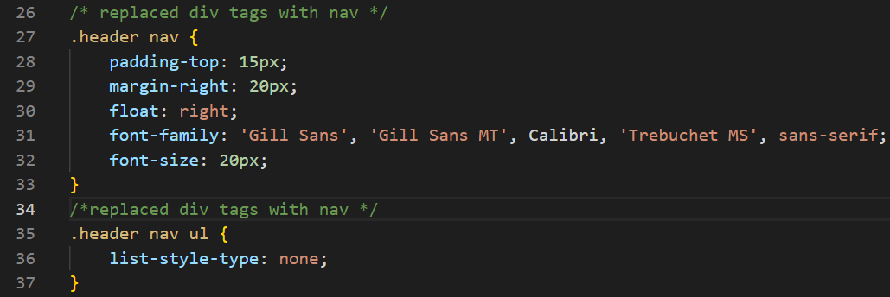

# <Horiseon-Optimized-Search-Engine>

## Description
This Horiseon Webpage is optimized by refactoring an existing starter code. This project provided Bootcamp students an opportunity to review, practice, and have a better understanding of HTML elements and their semantic flow. Refactoring allows students to learn HTML elements by doing research online for semantic and logical structure, and to communicate with future users by leaving comments throughout the process. By refactoring the code and having a logical HTML structure, users will have long-term sustainability and better accessibility. 

## Installation
N/A

## Usage
This project can be used as a reference to review HTML semantic flows and logical structures with comments along the way. 

<li> In index.html, any text/message located in <!-"text/message"-> will act as comments and indicate the changes that were made. </li>

<li> In style.css, any text/message located in /*"text/message"*/ will act as comments and indicate the changes that were made. </li>

## Credits
HTML Semantic Elements
https://www.w3schools.com/html/html5_semantic_elements.asp

## License
N/A

